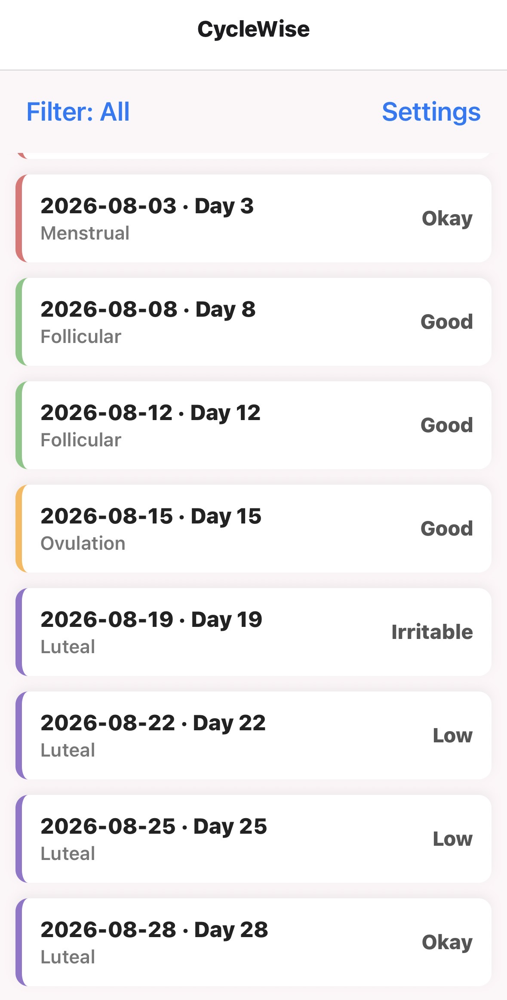
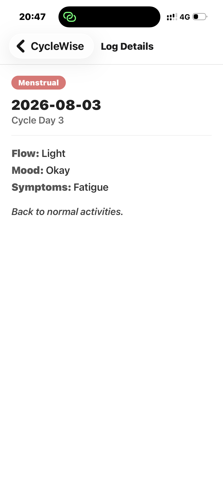
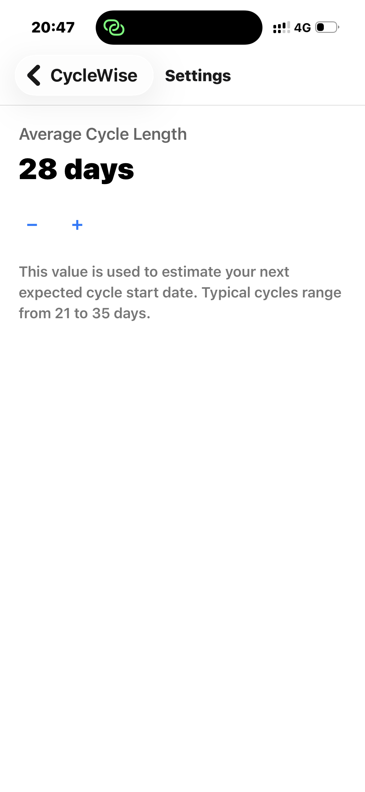

# CycleWise

A cycle and symptom awareness app aimed at teen girls / students.

## Target Domain
Healthcare / Adolescent Wellbeing

## Problem Statement
Many teenage girls track their periods informally (mental notes, paper
calendars) and struggle to connect recurring symptoms — cramps, mood
changes, fatigue — with where they are in their cycle. This makes it
hard to plan around school, sports, or exams, and hard to describe
patterns accurately to a doctor or parent.

## How CycleWise Solves It
- **Home screen**: a filterable list of past cycle log entries (date,
  cycle day, phase, mood), so the user can browse history and filter
  by phase (Menstrual / Follicular / Ovulation / Luteal) to spot
  patterns rather than just seeing a flat calendar.
- **Detail screen**: the full record for a single entry — flow,
  mood, symptoms, and a personal note — so context isn't lost.
- **Settings screen**: lets the user set their average cycle length,
  which is the basis for estimating the next expected cycle.

## Screens
1. **Home** — `screens/HomeScreen.js` — FlatList of 10 sample log
   entries, phase filter toggle (useState), navigates to Detail and
   Settings.
2. **Detail** — `screens/DetailScreen.js` — receives the selected
   entry via navigation params and displays it in full.
3. **Settings** — `screens/SettingsScreen.js` — average cycle length
   control (useState), +/- buttons.

## State Management
- `filterPhase` (HomeScreen) — controls which phase is currently
  filtered in the list.
- `cycleLength` (SettingsScreen) — the user's configured average
  cycle length in days (21–35 range).

## Data
Sample data lives in `data/cycleLogs.js` as a static local array
(10 entries), matching the Sprint 1 requirement to use local data
rather than a live API (API integration comes in Sprint 2).

## Setup Instructions
1. Clone this repo: `git clone <your-repo-url>`
2. Install dependencies: `npm install`
3. Start the dev server: `npx expo start`
4. Install **Expo Go** on your Android device from the Play Store
5. Scan the QR code shown in the terminal / browser with Expo Go to
   run the app on your phone

## Screenshots
|  |  |  |

## Notes on AI Tool Usage
This project was scaffolded with assistance from an AI tool for
structure and boilerplate. All architectural decisions (navigation
pattern, state placement, data shape) are understood by the author
and can be explained in full during the viva.
